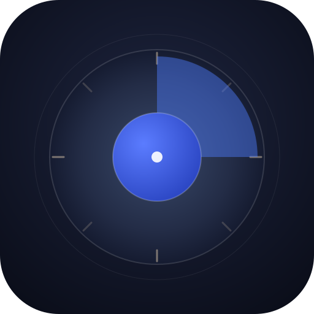
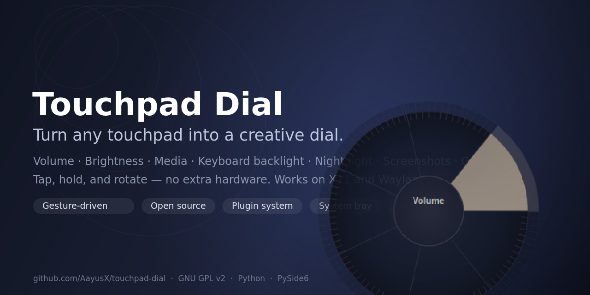
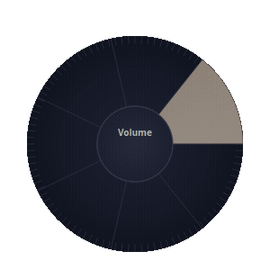

<div align="center">



# Touchpad Dial

### Turn any touchpad into a creative dial.

**Tap, hold, and rotate your touchpad to control volume, brightness, media, keyboard backlight, night light, screenshots, and GPU mode — no extra hardware.**

[](https://www.gnu.org/licenses/old-licenses/gpl-2.0.en.html)
[](https://www.python.org/)
[]()
[](docs/USAGE.md)
[](docs/USAGE.md)
[](https://doc.qt.io/qtforpython/)
[](docs/CONTRIBUTING.md)



</div>

---

## ✨ Why Touchpad Dial?

The **ASUS Creator Dial** is a physical knob found on premium creative laptops. It's a fantastic way to control tools while drawing, editing, or listening — but it's **proprietary, expensive, and locked to specific hardware**.

**Touchpad Dial recreates the entire experience in software** — right on the touchpad you already own. No dial hardware, no special laptops, no purchases.

If your touchpad can report multi-touch positions (virtually all modern ones can), you can have a creative dial:

| Need | Without Touchpad Dial | With Touchpad Dial |
|---|---|---|
| Change volume mid-work | Reach for keyboard / volume knob | Rotate on touchpad |
| Adjust brightness | Fumble with Fn keys | Rotate on touchpad |
| Next track | Alt-Tab to music app | Rotate on touchpad |
| Keyboard backlight | Keyboard shortcut | Rotate on touchpad |
| Night light | System settings hunt | Rotate on touchpad |
| Screenshot | PrintScreen + crop | Tap the center |
| GPU mode | Manufacturer software | Rotate on touchpad |

---

## 🚀 Quick Start

```bash
git clone https://github.com/AayusX/touchpad-dial.git
cd touchpad-dial
./install.sh
```

Log out and back in (group permissions), then:

```bash
systemctl --user start creatordial-daemon creatordial-ui
```

> [!TIP]
> Both services start automatically with your desktop session after install.

### How to use it in 10 seconds

1. **Move your finger to the top-right corner** of the touchpad and **hold for 1 second** — the dial activates and the touchpad is now a dial.
2. **Rotate your finger in a circle** to control the active function (volume by default).
3. **Quickly tap the center of the circle** to cycle to the next function.
4. **Hold the center for 1 second** — a segmented ring appears; rotate while holding to pick a function, release to select.



---

## 🎯 Features

- **Corner-activation gesture** — hold the top-right corner to turn the touchpad into a dial; the cursor is frozen while active so your mouse never jumps.
- **Rotary gesture recognition** — 90° detents, adjustable sensitivity, works on any multi-touch touchpad.
- **Circular function picker** — hold the center to open a segmented ring UI, rotate to browse, release to select. Fades away automatically so it never blocks you.
- **Silent by default** — normal rotation does what it does without popping up UIs; the overlay appears only when you ask for it.
- **7 built-in plugins** — Volume, Brightness, Media, Keyboard Backlight, Night Light, Screenshot/Recording, and GPU mode.
- **Plugin architecture** — drop a new plugin in `plugins/`, register it in `daemon.py`, done.
- **System tray** — quick show/hide and quit control.
- **Extensible config** — gestures, layout geometry, plugins, and themes all configurable (`~/.config/creatordial/config.json`).
- **Wayland- and X11-friendly** — automatically detects your desktop and uses the right IPC/DBus paths (KDE NightLight, PowerDevil brightness, Spectacle, etc.).
- **Auto-start services** — systemd user units install and enable themselves.

---

## 📦 Plugins

| Plugin | Rotate CW | Rotate CCW | Tap center | Hold center |
|---|---|---|---|---|
| [Volume](docs/plugins/volume.md) | Volume up | Volume down | Toggle mute | — |
| [Brightness](docs/plugins/brightness.md) | Brightness up | Brightness down | — | — |
| [Media](docs/plugins/media.md) | Next track | Previous track | Play / pause | Next track |
| [Keyb. Backlight](docs/plugins/keyboard.md) | Brightness up | Brightness down | Toggle | — |
| [Night Light](docs/plugins/nightlight.md) | Warmer | Cooler | Toggle | — |
| [Screenshot](docs/plugins/screen.md) | — | — | Screenshot | Record screen |
| [GPU Mode](docs/plugins/gpu.md) | Next mode | Previous mode | — | — |

> Adding your own? See the [plugin development guide](docs/development.md).

---

## 📚 Documentation

| Guide | What's inside |
|---|---|
| [Installation](docs/INSTALL.md) | System requirements, apt deps, udev, uninstall |
| [Usage](docs/USAGE.md) | All gestures, UI behavior, troubleshooting tips |
| [Configuration](docs/CONFIGURATION.md) | Every `config.json` option explained |
| [Architecture](docs/ARCHITECTURE.md) | Daemon ⇄ UI IPC, gesture engine, event flow |
| [Plugin Development](docs/development.md) | Write your own plugin in 10 minutes |
| [Troubleshooting](docs/TROUBLESHOOTING.md) | Logs, debug tool, common problems |

---

## 🔧 How it works (in 30 seconds)

```
┌─────────────────────────────┐      Unix socket       ┌─────────────────────────────┐
│  creatordial-daemon          │  /tmp/creatordial.sock │  creatordial-ui (PySide6)   │
│                             │ ──────────────────────►│  - Dial overlay widget      │
│  InputReader  (libevdev)     │    JSON datagrams      │  - Circular picker          │
│  GestureEngine (gestures)    │                        │  - System tray icon        │
│  PluginManager (volume, …)   │                        └─────────────────────────────┘
│  ActionExecutor (uinput keys)│
│  I2C controller (dialpad EC) │
└─────────────────────────────┘
```

**Touchpad events → gestures → plugin actions → system effects** (via D-Bus, uinput, or CLI), with live feedback drawn by the UI process.

Full deep-dive: [docs/ARCHITECTURE.md](docs/ARCHITECTURE.md).

---

## 🛠️ Tech Stack

- **Python 3.10+**
- **PySide6 / Qt 6** — the overlay UI, system tray, and animations
- **libevdev + uinput** — kernel input events and virtual key device
- **systemd user services** — auto-start daemon + UI
- **D-Bus** — KDE PowerDevil (brightness) and KWin NightLight integration
- **CLI fallbacks** — `wpctl`/`pactl`/`amixer` (volume), `spectacle`/`scrot` (screenshots), `nvidia-smi` (GPU)

---

## 🗺️ Roadmap

- [ ] Settings GUI (instead of raw JSON editing)
- [ ] Per-application profiles UI
- [ ] Gesture tweaks: haptic-style feedback, adjustable detent angle
- [ ] More plugins: app switcher, window management
- [ ] Conversation of the "scroll" companion gesture
- [ ] Flatpak / AUR packaging

---

## 🤝 Contributing

Contributions of all kinds are welcome — code, docs, translations, bug reports.

1. Fork it.
2. Create your feature branch (`git checkout -b feat/awesome`).
3. Commit your changes (`git commit -am 'Add awesome feature'`).
4. Push (`git push origin feat/awesome`).
5. Open a Pull Request.

See [docs/CONTRIBUTING.md](docs/CONTRIBUTING.md) for style and testing guidance.

---

## 📜 License

[GNU General Public License v2.0](LICENSE) — because the I2C/DialPad protocol work was reverse-engineered from the GPL-licensed [ASUS dialpad driver](https://github.com/asus-linux-drivers/asus-dialpad-driver), this project keeps that license and extends the same freedom to you.

---

<div align="center">

**If this project helps your workflow, a ⭐ goes a long way.**

[Report a bug](https://github.com/AayusX/touchpad-dial/issues/new?assignees=&labels=bug&projects=&template=bug_report.yml) · [Request a feature](https://github.com/AayusX/touchpad-dial/issues/new?assignees=&labels=enhancement&projects=&template=feature_request.yml) · [Read the docs](docs/INSTALL.md)

</div>