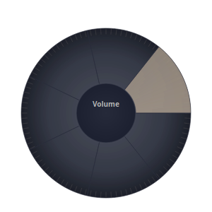

# Usage

Touchpad Dial maps small, natural gestures on your touchpad to system actions.
There are exactly four gestures to learn.

## The touchpad layout

The gesture zones are drawn on the touchpad in its own coordinate space
(hundreds or thousands of units, depending on your touchpad's resolution):

```
┌─────────────────────────────────────────────┐
│  ╭───────────╮   Activation zone        ▲   │
│  │           │   (top-right corner)    ══║══ │
│  │           │        hold 1s            ║   │
│  │    ●      │                            │   │
│  │  center   │   Rotate anywhere in the   │   │
│  │  button   │   large circle:            │   │
│  ╰───────────╯   ╭───────────────╮        │   │
│                   │               │       │   │
│                   │  ROTATION     │       │   │
│                   │   ZONE        │       │   │
│                   │               │       │   │
│                   ╰───────────────╯       │
└─────────────────────────────────────────────┘
```

- **Activation zone** — top-right corner, defaults to a 250×250 box.
- **Rotation zone** — a circle (default: diameter 1400 units) centered on the
  touchpad.
- **Center button** — a small circle (default: diameter 250 units) at the
  rotation zone's center.

## Gesture 1 — Activate

1. Place your finger in the **top-right corner** of the touchpad.
2. **Hold for 1 second** (default `activation_time`).
3. The touchpad becomes a dial: the **cursor is frozen** (the touchpad is
   exclusively grabbed) so your mouse never jumps mid-dial.
4. Rotate away!

To deactivate, tap the corner again (or the system hides after the
`inactivity_timeout` if you set one).

## Gesture 2 — Rotate

With the dial active, **rotate your finger around the circle's center**.

Rotation is quantized into **90° detents** by default. Each detent fires one
action:

- **Clockwise** ⇢ one step of the current plugin (e.g. volume up)
- **Counter-clockwise** ⇢ one step back (e.g. volume down)

The detent angle and sensitivity are adjustable in
[configuration](CONFIGURATION.md).

## Gesture 3 — Center tap

A **quick tap in the center circle** (< 0.3 s) **cycles to the next plugin**:

`Volume → Brightness → GPU → Media → Keyboard → Screen → Night Light → Volume …`

## Gesture 4 — Center hold (function picker)

1. **Hold the center circle for 1 second**.
2. A **segmented ring UI** appears around your finger showing all plugins.
3. **Rotate while holding** to move the highlight around the ring.
4. **Lift your finger** to select the highlighted plugin.
5. The ring fades out automatically after ~2 s — it never stays in the way.



## Plugin actions

| Plugin | Appears as | Rotate CW | Rotate CCW | Center tap | Center hold |
|---|---|---|---|---|---|
| Volume | 🔊 | Up | Down | Mute toggle | — |
| Brightness | ☀️ | Up | Down | — | — |
| GPU | 🎮 | Silent → Balanced → Performance | reverse | — | — |
| Media | 🎵 | Next | Previous | Play / Pause | Next |
| Keyboard | ⌨️ | Backlight + | Backlight − | Toggle | — |
| Screenshot | 📷 | — | — | Screenshot | Start/stop recording |
| Night Light | 🌙 | Warmer | Cooler | Toggle | — |

Every plugin has smart fallbacks so it works across desktop environments (see
[Troubleshooting](TROUBLESHOOTING.md) if a plugin doesn't do anything).

## System tray

The UI runs in the system tray:

- **Double-click the tray icon** — show/hide the dial overlay.
- **Right-click** — Show Dial, Quit.

## Feedback model (why it feels calm)

- Normal rotation actions are **silent** — no popup, no distraction.
- The overlay appears **only** when you hold the center (`function picker`) and
  fades after ~2 s.

This keeps your focus on the work while the dial quietly does its job.

## Customizing

Everything — zone sizes, hold times, sensitivity, plugin enablement, themes —
lives in `~/.config/creatordial/config.json`. See
[Configuration](CONFIGURATION.md) for the full reference.

## Multi-monitor note

The overlay renders at the touchpad's screen position. If you use multiple
monitors, the dial follows the touchpad's monitor.